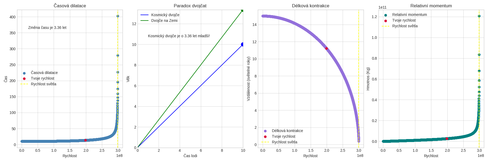

# ⏱️ time-dilation-visualizer

> Visualize Einstein's Special Relativity effects — time dilation, length contraction, relativistic momentum and the twin paradox.


---

## 🌌 What is this?

Ever wondered what would actually happen if you traveled at 99% the speed of light?

This tool lets you explore **Einstein's Special Relativity** interactively. Enter your speed, travel time, distance and mass — and get four detailed graphs showing exactly how physics breaks at relativistic speeds.

Built with Python and matplotlib. No physics degree required.

---

## 📊 What you get

Four graphs rendered side by side:

| # | Graph | What it shows |
|---|-------|---------------|
| 1 | ⏱️ **Time Dilation** | How time slows down as speed increases toward `c` |
| 2 | 👯 **Twin Paradox** | Age difference between a traveler and someone on Earth |
| 3 | 📏 **Length Contraction** | How distances shrink at relativistic speeds |
| 4 | 💨 **Relativistic Momentum** | Why momentum approaches infinity near `c` |

Your specific speed is highlighted as a **red dot** on each graph so you can see exactly where you are.

---

## 📦 Installation

Make sure you have Python 3 installed, then:

```bash
pip install matplotlib
```

That's it. No other dependencies.

---

## ▶️ Running it

```bash
python Dilation.py
```

You'll be asked for:

```
Časový interval v letech: 50               # Travel time in years
Rychlost v metrech za sekundu: 290000000   # Speed in m/s (max: 299,792,458)
Vzdálenost v světelných letech: 10         # Distance in light years
Hmotnost tělesa v kilogramech: 70          # Mass in kg
```

The graph opens automatically and saves as `Celé.png` (or `Celé1.png`, `Celé2.png`... if the file already exists).

---

## 📸 Example output



### Example run

```
Časový interval v letech: 50
Rychlost v metrech za sekundu: 290000000
Vzdálenost v světelných letech: 10
Hmotnost tělesa v kilogramech: 70
```

**Results:**

| Effect | Result |
|--------|--------|
| ⏱️ Traveler ages | 50 years |
| 🌍 Earth person ages | ~197 years |
| 📏 Contracted distance | ~3.6 light years |
| 💨 Momentum | ~8.53 × 10¹¹ kg·m/s |

> At 96.7% the speed of light, the traveler arrives **147 years younger** than someone who stayed home.

---

## 🧠 The physics

### ⏱️ Time Dilation
```
t' = t / √(1 - v²/c²)
```
Moving clocks run slower. At 99% the speed of light, 1 year on the ship = ~7 years on Earth. At `c`, time stops completely.

### 📏 Length Contraction
```
L = L₀ × √(1 - v²/c²)
```
The opposite of time dilation — distances shrink in the direction of travel. A 10 light year journey might feel like only 2-3 light years to the traveler.

### 👯 Twin Paradox
One twin stays home. The other flies away at near-light speed and comes back. The traveling twin returns **younger** — not by a little, but potentially by decades. This is not science fiction. It's been verified experimentally.

### 💨 Relativistic Momentum
```
p = mv / √(1 - v²/c²)
```
At low speeds this is just `p = mv`. But near `c`, momentum grows toward **infinity** — which is why no object with mass can ever reach the speed of light. You'd need infinite energy.

---

## 💾 Output

Every run auto-saves the graph:
- First run → `Celé.png`
- Second run → `Celé1.png`
- Third run → `Celé2.png`
- ...and so on

No previous results are ever overwritten.

---

## 🛠️ Built with

- [Python 3](https://www.python.org/)
- [matplotlib](https://matplotlib.org/)
- Einstein's brain (1905)

---

## 👨‍💻 Author

Made with curiosity, Python and way too much interest in physics.

---

## 📄 License

MIT — do whatever you want with it.

---

> *"The distinction between past, present and future is only a stubbornly persistent illusion."*
>
> — Albert Einstein
